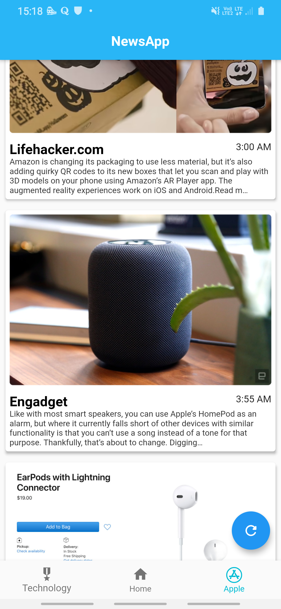

# start

**NewsApp is the App which gets the data form the API which is shared by News API.**

1.**Top HeadLines News Of US.**

2.**Shows the news Which is related to technology.**

3.**Shows the news related to the APPLE**

'

4.**NEWS DESCRIPTION**

**Here  I am sharing the url of the NewsApi.org website where anybody can get the free API.
https://newsapi.org/**
## Getting Started

This project is a starting point for a Flutter application.

A few resources to get you started if this is your first Flutter project:

- [Lab: Write your first Flutter app](https://flutter.dev/docs/get-started/codelab)
- [Cookbook: Useful Flutter samples](https://flutter.dev/docs/cookbook)

For help getting started with Flutter, view our
[online documentation](https://flutter.dev/docs), which offers tutorials,
samples, guidance on mobile development, and a full API reference.
